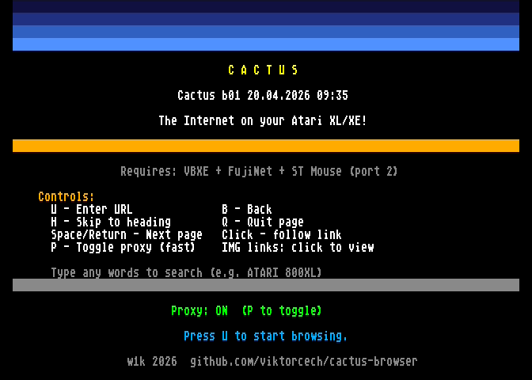
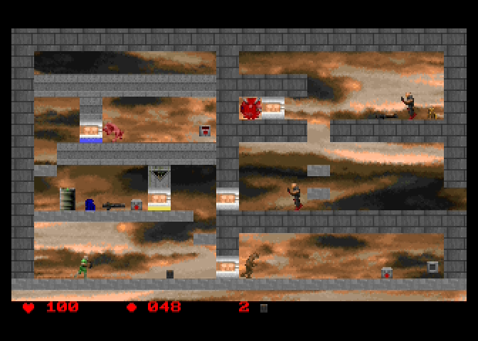
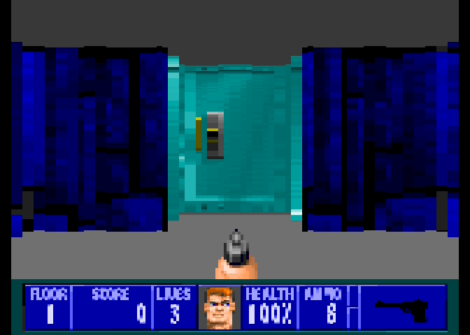
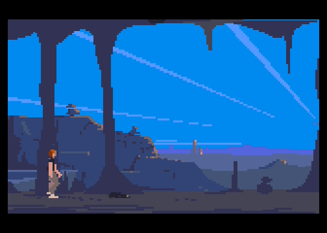
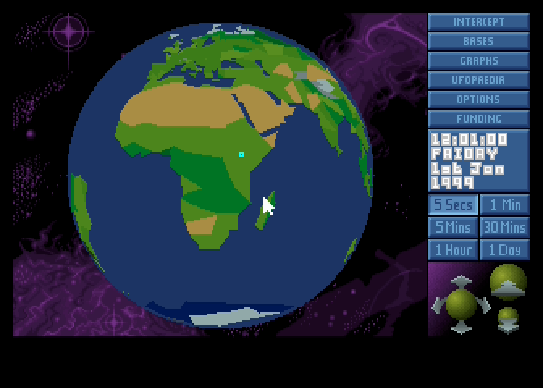
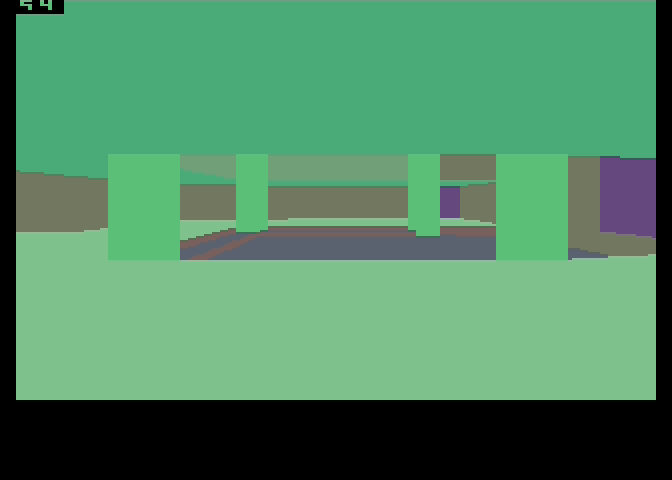

<h1>W1K — ATARI 800XE/XL, AI PROJECTS</h1>

<table>
  <!-- cactus-browser -->
  <tr>
    <td width="58%" valign="top">
      <h3>cactus-browser</h3>
      
Web browser for the Atari XL/XE — surf the internet right on an 8-bit machine.
         Requires VBXE, FujiNet and an ST mouse (port 2).

      
<a href="https://github.com/viktorcech/cactus-browser">github.com/viktorcech/cactus-browser</a>

    </td>
    <td width="42%" valign="top">
      
    </td>
  </tr>

  <!-- doom2d-atari -->
  <tr>
    <td width="58%" valign="top">
      <h3>doom2d-atari</h3>
      
Side-scrolling action game in the style of Doom 2D for the Atari XL/XE.
         6502 assembly, VBXE graphics.

      
<a href="https://github.com/viktorcech/doom2d-atari">github.com/viktorcech/doom2d-atari</a>

    </td>
    <td width="42%" valign="top">
      
    </td>
  </tr>

  <!-- Wolfenstein 3D (demo) -->
  <tr>
    <td width="58%" valign="top">
      <h3>Wolfenstein 3D</h3>
      
Raycasting FPS in the style of Wolfenstein 3D for the Atari XL/XE (VBXE).

      
demo · WIP

    </td>
    <td width="42%" valign="top">
      
    </td>
  </tr>

  <!-- Another World (demo) -->
  <tr>
    <td width="58%" valign="top">
      <h3>Another World</h3>
      
Port of the cinematic adventure Another World (Out of This World) for the Atari XL/XE.

      
demo · WIP

    </td>
    <td width="42%" valign="top">
      
    </td>
  </tr>

  <!-- UFO / X-COM (demo) -->
  <tr>
    <td width="58%" valign="top">
      <h3>UFO: Enemy Unknown</h3>
      
Geoscape demo in the style of UFO: Enemy Unknown (X-COM) — globe and base management on the Atari XL/XE.

      
demo · WIP

    </td>
    <td width="42%" valign="top">
      
    </td>
  </tr>

  <!-- Doom raycasting test (demo) -->
  <tr>
    <td width="58%" valign="top">
      <h3>Doom engine test</h3>
      
Raycasting 3D engine test (Doom-style) for the Atari XL/XE — FPS benchmark.

      
demo · WIP

    </td>
    <td width="42%" valign="top">
      
    </td>
  </tr>
</table>
