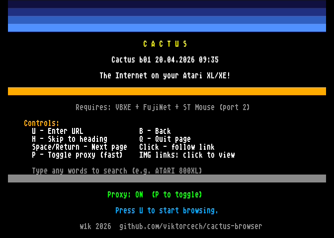
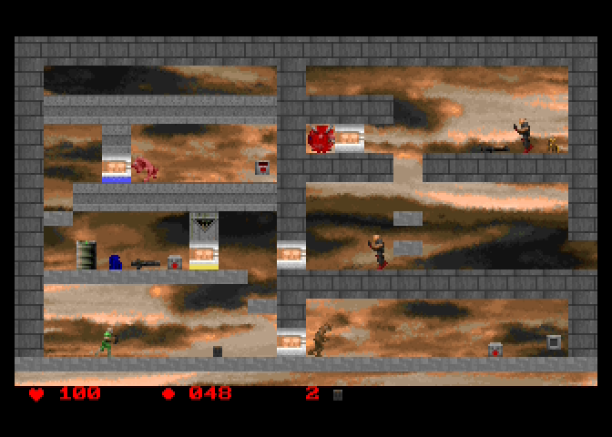
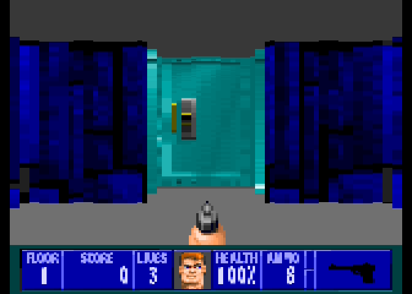
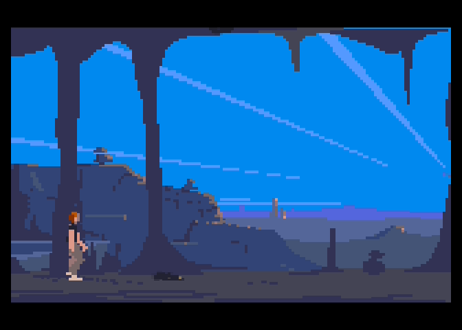
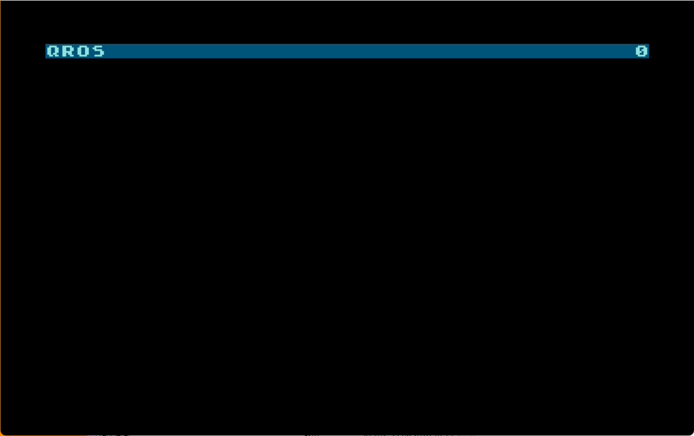
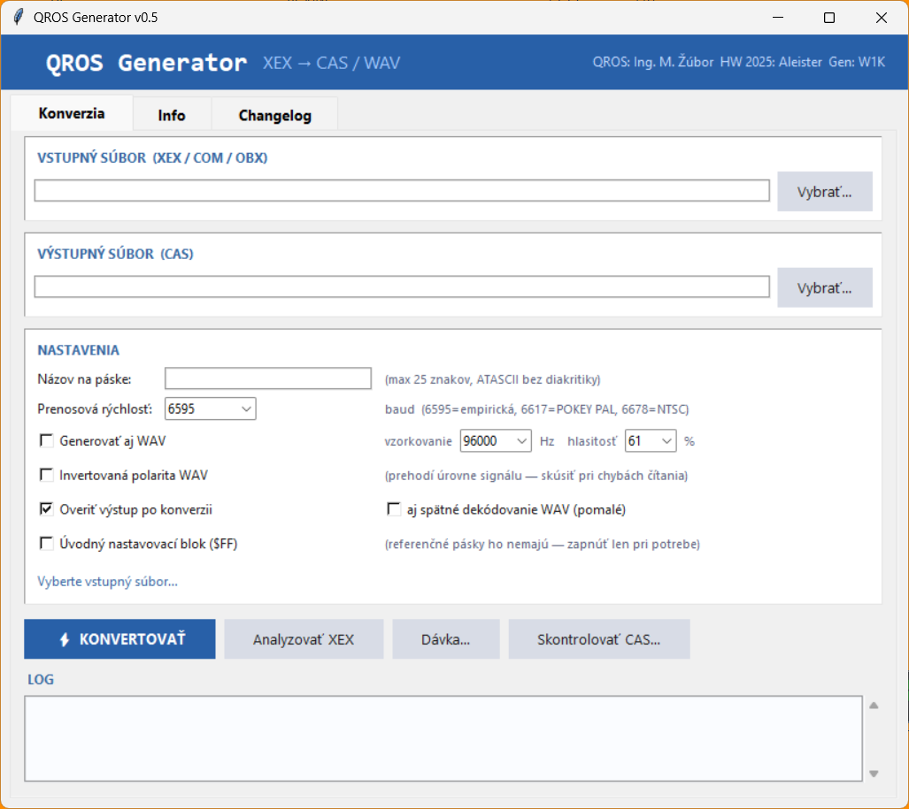
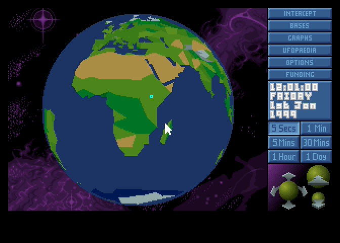

<h1>W1K — ATARI 800XE/XL, AI PROJECTS</h1>

<table>
  <!-- DOOM VBXE -->
  <tr>
    <td width="58%" valign="top">
      <h3>DOOM VBXE</h3>
      
DOOM for the Atari XL/XE — a real BSP renderer with textured walls, sprites and monsters,
         all three episodes streamed off the disk. Requires VBXE and a Rapidus accelerator.

      
<a href="https://github.com/viktorcech/doom-vbxe">github.com/viktorcech/doom-vbxe</a>

    </td>
    <td width="42%" valign="top">
    </td>
  </tr>

  <!-- Cactus Browser VBXE -->
  <tr>
    <td width="58%" valign="top">
      <h3>Cactus Browser VBXE</h3>
      
Web browser for the Atari XL/XE — surf the internet right on an 8-bit machine.
         Requires VBXE, FujiNet and an ST mouse (port 2).

      
<a href="https://github.com/viktorcech/cactus-browser">github.com/viktorcech/cactus-browser</a>

    </td>
    <td width="42%" valign="top">
      
    </td>
  </tr>

  <!-- Doom 2D VBXE -->
  <tr>
    <td width="58%" valign="top">
      <h3>Doom 2D VBXE</h3>
      
Side-scrolling action game in the style of Doom 2D for the Atari XL/XE.
         6502 assembly, VBXE graphics.

      
<a href="https://github.com/viktorcech/doom2d-atari">github.com/viktorcech/doom2d-atari</a>

    </td>
    <td width="42%" valign="top">
      
    </td>
  </tr>

  <!-- Wolfenstein 3D VBXE -->
  <tr>
    <td width="58%" valign="top">
      <h3>Wolfenstein 3D VBXE</h3>
      
Raycasting FPS in the style of Wolfenstein 3D for the Atari XL/XE.

      
<a href="https://github.com/viktorcech/wolfenstein3d-vbxe">github.com/viktorcech/wolfenstein3d-vbxe</a>

    </td>
    <td width="42%" valign="top">
      
    </td>
  </tr>

  <!-- Another World VBXE -->
  <tr>
    <td width="58%" valign="top">
      <h3>Another World VBXE</h3>
      
Port of the cinematic adventure Another World for the Atari XL/XE.

      
<a href="https://github.com/viktorcech/another-world-vbxe">github.com/viktorcech/another-world-vbxe</a>

    </td>
    <td width="42%" valign="top">
      
    </td>
  </tr>

  <!-- QROS Loader -->
  <tr>
    <td width="58%" valign="top">
      <h3>QROS Loader</h3>
      
Turbo tape loader for the QROS/EMO system on the Atari XL/XE. 6502 assembly — streams
         the tape through POKEY and parses the XEX format on the fly.

      
<a href="https://github.com/viktorcech/qros-loader">github.com/viktorcech/qros-loader</a>

    </td>
    <td width="42%" valign="top">
      
    </td>
  </tr>

  <!-- QROS Generator -->
  <tr>
    <td width="58%" valign="top">
      <h3>QROS Generator</h3>
      
Tape image generator for the QROS/EMO turbo system — converts Atari XEX/COM/OBX
         executables into CAS and WAV tapes. Python, GUI and command line.

      
<a href="https://github.com/viktorcech/qros-generator">github.com/viktorcech/qros-generator</a>

    </td>
    <td width="42%" valign="top">
      
    </td>
  </tr>

  <!-- UFO: Enemy Unknown VBXE (demo) -->
  <tr>
    <td width="58%" valign="top">
      <h3>UFO: Enemy Unknown VBXE</h3>
      
Geoscape demo in the style of UFO: Enemy Unknown (X-COM) — globe and base management on the Atari XL/XE.

      
demo · WIP

    </td>
    <td width="42%" valign="top">
      
    </td>
  </tr>

</table>

  

